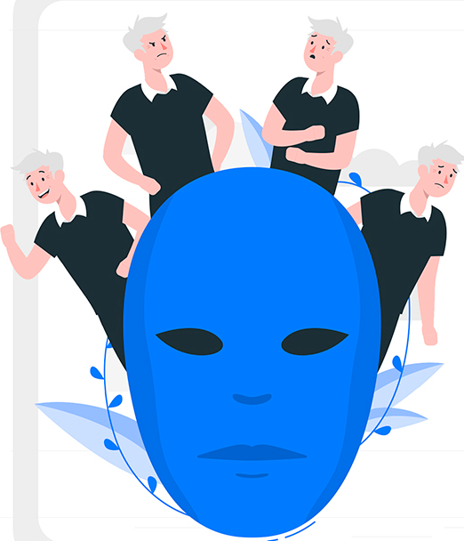
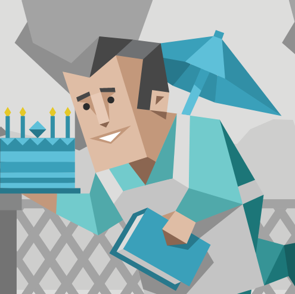
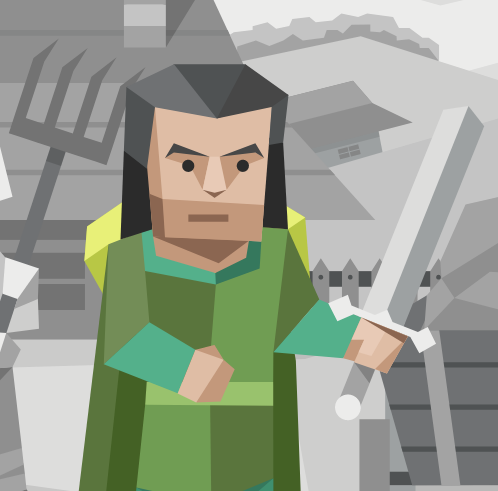
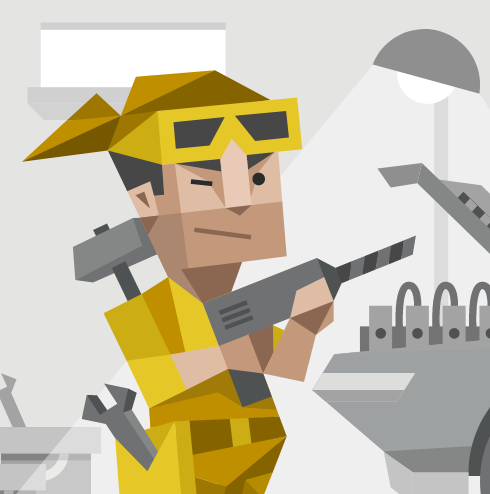
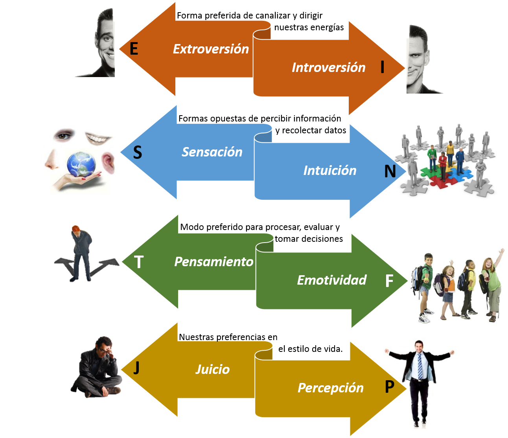
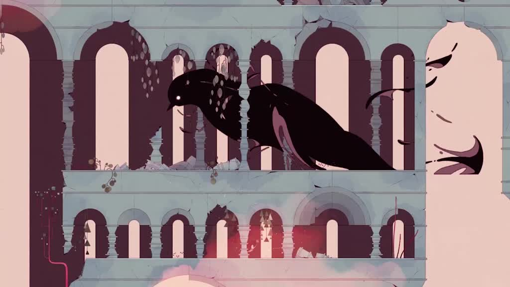

# El tema de este curso 23-24 es... \

---

Primera pista:

{width=30%}

---

Segunda pista:

{width=25%}
{width=25%}
{width=25%}
{width=25%}

---

Última pista: 

{width=60%}

---

## Personalidades MBTI

Conjunto de rasgos y cualidades que configuran la manera de ser de una persona y la diferencian de las demá.
Nuestra personalidad describe:

- Cómo interactuamos con el entorno
- Cómo vemos y procesamos la información
- Cómo tomamos decisiones y afrontamos las emociones
- Cómo enfocamos el trabajo y cómo nos planificamos 
- Cuál es la confianza que tenemos en nosotros mismos

---

## Inspiración

Jugad con las personalidades

- Escenarios, representar gráficamente las personalidades
- Personajes, personalidad marcada en NPCs
- Mecánicas, inventad mecánicas relacionadas con las dimensiones del test de personalidad
- Los propios personajes de esta [web](https://www.16personalities.com/es)
- ...

Sed imaginativos, haced brainstorming y proponednos varias ideas.
Podemos ayudaros a concretar las ideas y definir el alcance para la asignatura.

# Ejemplo motivador

---

Las fases de duelo, inspiración para Gris (*Nomada Studio*)

{width=40%}
{width=45%}

Negación, ira, negociación, depresión y aceptación.
Negro y blanco, rojo, verde, azul, amarillo.
