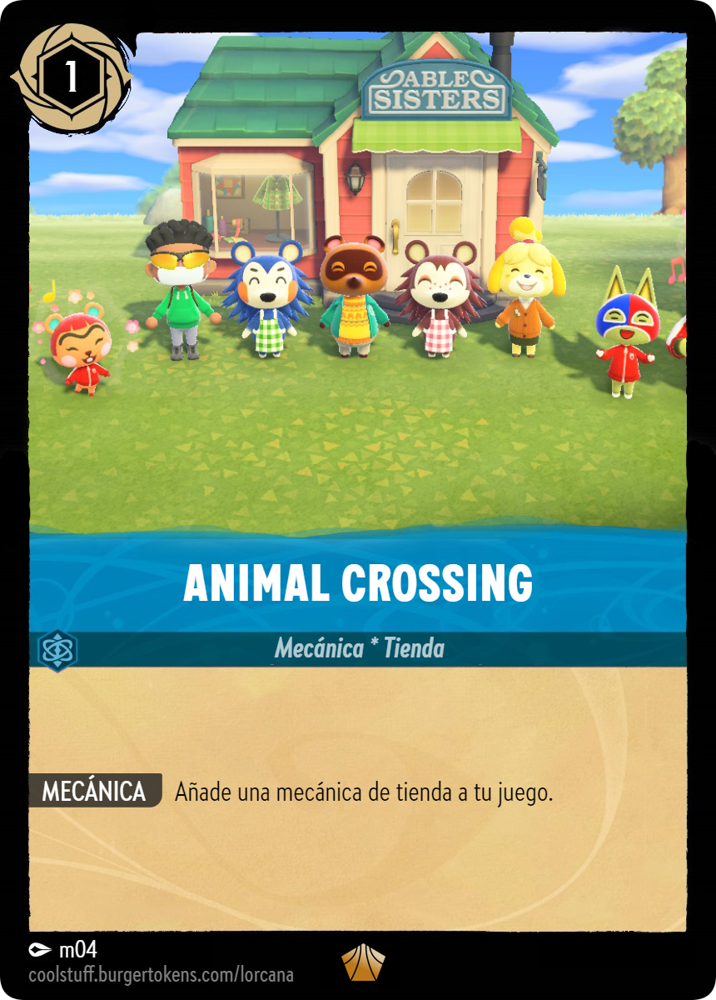
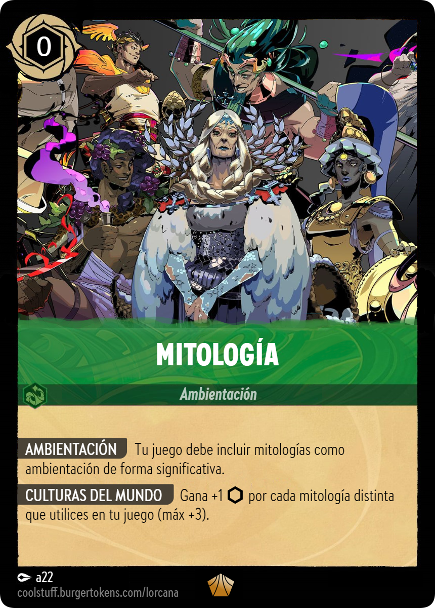

# El tema de este curso 24-25 es... \

---

Primera pista:

{width=60%}

---

Segunda pista:

{width=60%}

---

Tercera pista: 

{width=60%}

---

Última pista

{width=60%}

---

## Cartas

Representación, significado de las figuras, 
características como el palo o el valor...

---

## Inspiración

Sed imaginativos, haced brainstorming y proponednos varias ideas.

Podemos ayudaros a concretar las ideas y definir el alcance para la asignatura.

---

# Bonus

---

Sistema de cartas para cumplir con el proyecto.

Todos debéis robar 3 cartas, elegid al menos una cada uno condicionará vuestro proyecto.

Elección de cara al primer hito de la asignatura.

{width=20%}
{width=20%}
{width=20%}